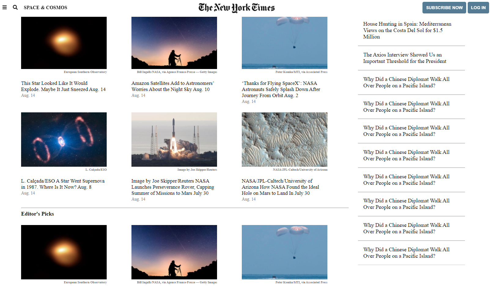

# New York Times Article

First CSS project of Lidya Ghebreigziabher and Abhigyan Mahanta

<h1>Additional description about the project and its features.</h1>

This is a project to demonstrate the exisiting knowledge of HTML and CSS. It is a collaborative project which recreates a New York Times article.

<i>Built With HTML5, CSS3, GIT, and VSCODE</i>

Live Demo : https://new-york-times-article.netlify.app

<h1>Getting Started</h1>

To get a local copy up and running follow these simple example steps.

1. Go to https://github.com/Lidya1234/NEW_YORK_TIMES_ARTICLE/tree/feature
2. Click on code and copy the html code.
3. Use git bash to clone this repository on your local machine.
4. Run git checkout -b your-branch-name Make your contributions 
5. Push your branch up to your forked repository
6. Open a Pull Request with a detailed description to the development branch of the original project for a review

Prerequisites Text editor,Github profile and Git.

<h2>Authors</h2>

👤 Author1

Github: @Lidya1234 Linkedin: https://www.linkedin.com/in/lidya-ghebreigziabher-4a94391aa/

👤 Author2

Github: @Abhigyan001 Linkedin: https://www.linkedin.com/in/abhigyan-mahanta-b49799145/

🤝 Contributing Contributions, issues and feature requests are welcome!

Feel free to check the issues page.

Show your support Give a ⭐️ if you like this project!

Acknowledgments Hat tip to anyone whose code was used Inspiration etc

📝 License This project is a collaboration project of microverse students. All rights are reserved for Lidya and Abhigyan.
